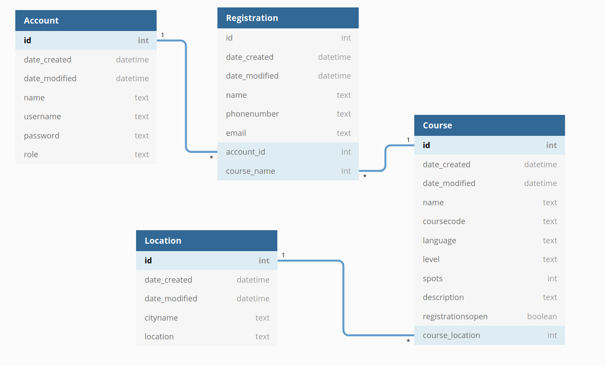

# Tietokantakaavio

Huom.! Availability tullaan lisäämään Course-tauluun lähiaikoina.

## CREATE TABLE -lauseet

~~~~sql

CREATE TABLE location (
	id INTEGER NOT NULL, 
	date_created DATETIME, 
	date_modified DATETIME, 
	cityname VARCHAR(144) NOT NULL, 
	location VARCHAR(144) NOT NULL, 
	PRIMARY KEY (id)
);

CREATE TABLE account (
	id INTEGER NOT NULL, 
	date_created DATETIME, 
	date_modified DATETIME, 
	name VARCHAR(144) NOT NULL, 
	username VARCHAR(144) NOT NULL, 
	password VARCHAR(144) NOT NULL, 
	role VARCHAR(144) NOT NULL, 
	PRIMARY KEY (id)
);

CREATE TABLE course (
	id INTEGER NOT NULL, 
	date_created DATETIME, 
	date_modified DATETIME, 
	name VARCHAR(144) NOT NULL, 
	coursecode VARCHAR(144) NOT NULL, 
	language VARCHAR(144) NOT NULL, 
	level VARCHAR NOT NULL, 
	spots INTEGER NOT NULL, 
	course_location INTEGER NOT NULL, 
	description VARCHAR(144) NOT NULL, 
	registrationsopen BOOLEAN NOT NULL, 
	PRIMARY KEY (id), 
	FOREIGN KEY(course_location) REFERENCES location (id) ON DELETE CASCADE, 
	CHECK (registrationsopen IN (0, 1))
);

CREATE TABLE registration (
	id INTEGER NOT NULL, 
	date_created DATETIME, 
	date_modified DATETIME, 
	name VARCHAR(144) NOT NULL, 
	phonenumber VARCHAR NOT NULL, 
	email VARCHAR(144) NOT NULL, 
	course_name INTEGER NOT NULL, 
	account_id INTEGER NOT NULL, 
	PRIMARY KEY (id), 
	FOREIGN KEY(course_name) REFERENCES course (id) ON DELETE CASCADE, 
	FOREIGN KEY(account_id) REFERENCES account (id)
);
~~~~

